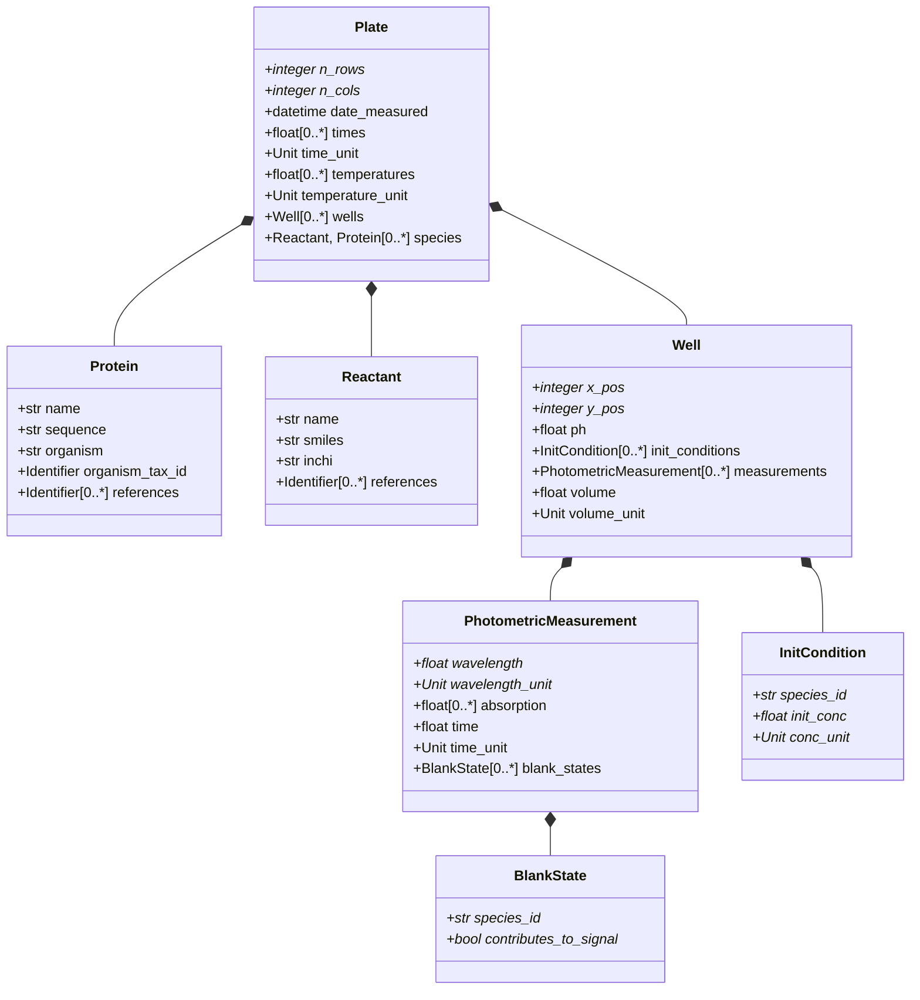

```mermaid
classDiagram
    Plate *-- Protein
    Plate *-- Reactant
    Plate *-- Well
    Well *-- PhotometricMeasurement
    Well *-- InitCondition
    PhotometricMeasurement *-- BlankState
    
    class Plate {
        +integer n_rows*
        +integer n_cols*
        +datetime date_measured
        +float[0..*] times
        +Unit time_unit
        +float[0..*] temperatures
        +Unit temperature_unit
        +Well[0..*] wells
        +Reactant, Protein[0..*] species
    }
    
    class Protein {
        +str name
        +str sequence
        +str organism
        +Identifier organism_tax_id
        +Identifier[0..*] references
    }
    
    class Reactant {
        +str name
        +str smiles
        +str inchi
        +Identifier[0..*] references
    }
    
    class Well {
        +integer x_pos*
        +integer y_pos*
        +float ph
        +InitCondition[0..*] init_conditions
        +PhotometricMeasurement[0..*] measurements
        +float volume
        +Unit volume_unit
    }
    
    class PhotometricMeasurement {
        +float wavelength*
        +Unit wavelength_unit*
        +float[0..*] absorption
        +float time
        +Unit time_unit
        +BlankState[0..*] blank_states
    }
    
    class InitCondition {
        +str species_id*
        +float init_conc*
        +Unit conc_unit*
    }
    
    class BlankState {
        +str species_id*
        +bool contributes_to_signal*
    }
    
```