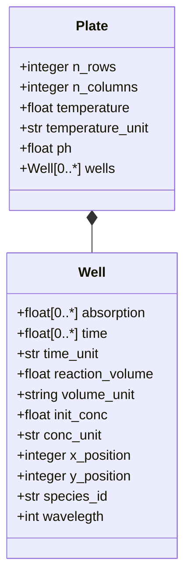

```mermaid
classDiagram
    Plate *-- Well
    
    class Plate {
        +integer n_rows
        +integer n_columns
        +float temperature
        +str temperature_unit
        +float ph
        +Well[0..*] wells
    }
    
    class Well {
        +float[0..*] absorption
        +float[0..*] time
        +str time_unit
        +float reaction_volume
        +string volume_unit
        +float init_conc
        +str conc_unit
        +integer x_position
        +integer y_position
        +str species_id
        +int wavelegth
    }
    
```