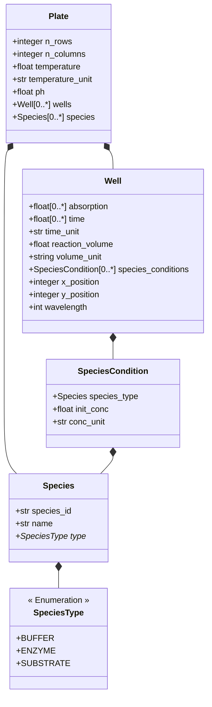

```mermaid
classDiagram
    Plate *-- Well
    Plate *-- Species
    Well *-- SpeciesCondition
    Species *-- SpeciesType
    SpeciesCondition *-- Species
    
    class Plate {
        +integer n_rows
        +integer n_columns
        +float temperature
        +str temperature_unit
        +float ph
        +Well[0..*] wells
        +Species[0..*] species
    }
    
    class Well {
        +float[0..*] absorption
        +float[0..*] time
        +str time_unit
        +float reaction_volume
        +string volume_unit
        +SpeciesCondition[0..*] species_conditions
        +integer x_position
        +integer y_position
        +int wavelength
    }
    
    class Species {
        +str species_id
        +str name
        +SpeciesType type*
    }
    
    class SpeciesCondition {
        +Species species_type
        +float init_conc
        +str conc_unit
    }
    
    class SpeciesType {
        << Enumeration >>
        +BUFFER
        +ENZYME
        +SUBSTRATE
    }
    
```