# MTPHandler - _🚧 currently unstable 🚧_

[](https://fairchemistry.github.io/MTPHandler/)
[](https://github.com/FAIRChemistry/MTPHandler/actions/workflows/tests.yml)
[](https://badge.fury.io/py/MTPHandler)


## ℹ️ Overview

MTPHandler is a tool for managing and processing data from microtiter plates. It allows to directly read in the output files of various photometers, enabling low friction data processing. The tool facilitates a workflow for reading in raw data, assigning molecules with their respective concentration and and unit to wells. Furthermore, wells for creating a standard curve can be automatically detected and applied to different calibration models, which can be used to calculate the concentration of unknown samples. Finally, the plate data can be transformed into time-course concentration data in the EnzymeML format for subsequent analysis of the concentration data.

``` mermaid
graph LR
  AP[🧪 Plate Reader] --> A[📄 Output File];
  style AP fill:transparent,stroke:#000,stroke-width:2px;
A -->|read| B{MTPHandler}
  style B stroke-width:4px
  subgraph in Jupyter Notebook
    subgraph with MTPHandler
        B --> B1[Enrich Data with Metadata]
        B1 --> B2[Blank Data]
        B2 --> B3[Create and Apply Calibration Models]
        B3 --> B

        style B1 stroke-dasharray: 5, 5
        style B2 stroke-dasharray: 5, 5
        style B3 stroke-dasharray: 5, 5
    end
  B -->|convert| G[📄 EnzymeML time-course Data]
  G <-.-> H[📊 Data Science and Insights]

  style H stroke-dasharray: 5, 5,fill:transparent
  end
  G -->|export| I[📄 EnzymeML File]
```



## ⭐ Key Features

- **🚀 Parser Functions**  
   Features a custom parser for various plate readers, enabling low-fricton data processing.

- **🌟 Enrich measured data with metadata**  
    Assigns molecules with their respective concentration and unit to wells, capturing the experimental context of each well.

- **⚙️ Adaptive Data Processing**  
   Automatically adapts and blanks measurement data based on initial conditions set for each well. Treats wells without protein as calibration data and wells with protein as reaction data.

- **🌐 FAIR Data**  
   Maps well data to the standardized EnzymeML format, yielding time-course data with metadata for further analysis.

## 🔬 Supported Plate Readers

The following table lists the currently supported plate readers output files:

| Manufacturer       | Model                        | File Format |
|--------------------|------------------------------|-------------|
| Agilent            | BioTek Epoch 2               | `xlsx`      |
| Molecular Devices  | SpectraMax 190               | `txt`       |
| Tekan              | Magellan (processing software)| `xlsx`     |
| Tekan              | Spark                        | `xlsx`      |
| Thermo Scientific  | Multiskan SkyHigh            | `xlsx`      |
| Thermo Scientific  | Multiskan Spectrum 1500      | `txt`       |


## 📦 Installation

Install `MTPHandler` via pip:

```bash
pip install MTPHandler # 🚧 not released yet
```
or from source:

```bash
pip install git+https://github.com/FAIRChemistry/MTPHandler.git
```
